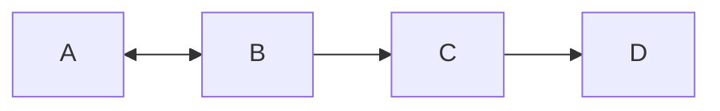
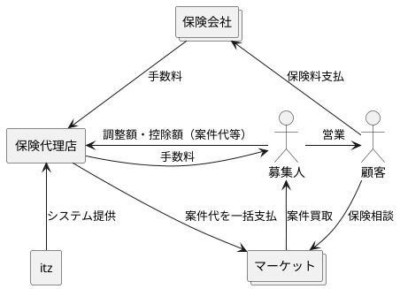
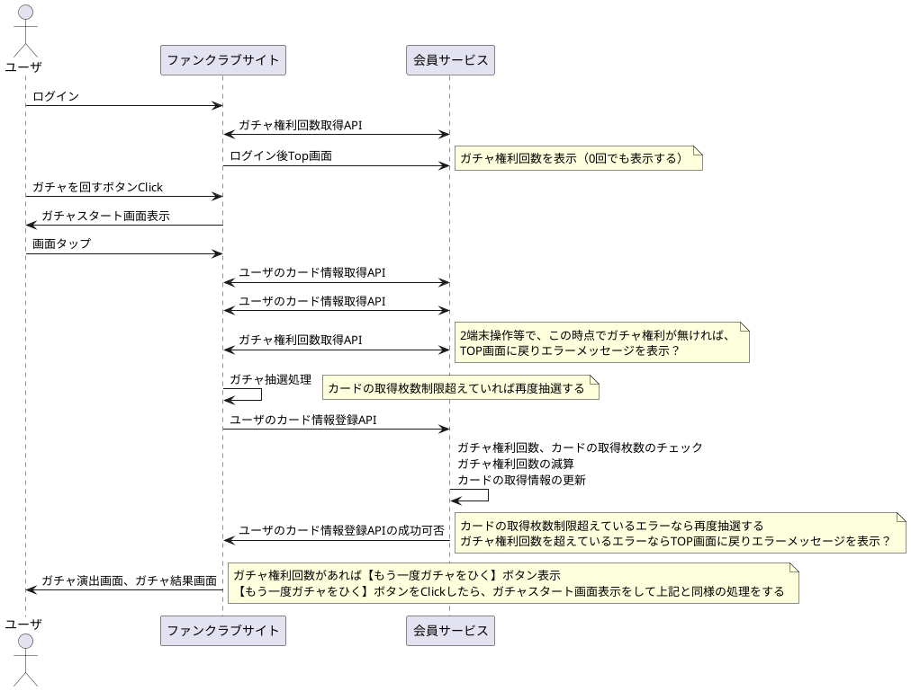

# 関連図





# シーケンス図



# 構成図

AWSPUMLを使用してAWS構成図
https://github.com/awslabs/aws-icons-for-plantuml

```plantuml
@startuml
!define AWSPUML https://raw.githubusercontent.com/milo-minderbinder/AWS-PlantUML/release/18-2-22/dist

!includeurl AWSPUML/common.puml
!includeurl AWSPUML/ApplicationServices/AmazonAPIGateway/AmazonAPIGateway.puml
!includeurl AWSPUML/Compute/AWSLambda/AWSLambda.puml
!includeurl AWSPUML/Compute/AWSLambda/LambdaFunction/LambdaFunction.puml
!includeurl AWSPUML/Database/AmazonDynamoDB/AmazonDynamoDB.puml
!includeurl AWSPUML/Database/AmazonDynamoDB/table/table.puml
!includeurl AWSPUML/General/AWScloud/AWScloud.puml
!includeurl AWSPUML/General/client/client.puml
!includeurl AWSPUML/General/user/user.puml
!includeurl AWSPUML/SDKs/JavaScript/JavaScript.puml
!includeurl AWSPUML/Storage/AmazonS3/AmazonS3.puml
!includeurl AWSPUML/Storage/AmazonS3/bucket/bucket.puml

skinparam componentArrowColor Black
skinparam componentBackgroundColor White
skinparam nodeBackgroundColor White
skinparam agentBackgroundColor White
skinparam artifactBackgroundColor White

USER(user)
CLIENT(browser)
JAVASCRIPT(js,SDK)

AWSCLOUD(aws) {

  AMAZONS3(s3) {
    BUCKET(site,www.insecurity.co)
    BUCKET(logs,logs.insecurity.co)
  }

  AMAZONAPIGATEWAY(api)

  AWSLAMBDA(lambda) {
    LAMBDAFUNCTION(addComments,addComments)
  }

  AMAZONDYNAMODB(dynamo) {
    TABLE(comments,Comments)
  }
}

user - browser

browser -d-> site :**1a**) get\nstatic\ncontent
site ~> logs :1a
site .u.> browser :**1b**
browser - js
js -r-> comments :**2a**) get\ncomments
comments ..> js :**2b**

js -r-> api :**3**) add\ncomment

api -d-> addComments :**4**

addComments -> comments :**5**

comments ..> js :**6**) new\ncomments
@enduml
```