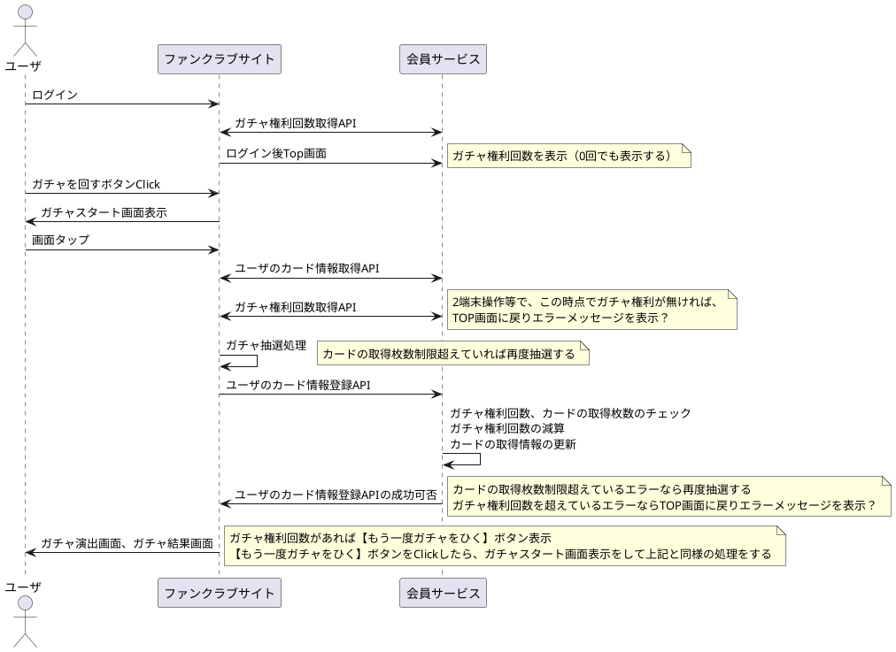

```plantuml
@startuml
actor ユーザ
participant ファンクラブサイト as fan
participant 会員サービス as kai

ユーザ->fan: ログイン
fan<->kai: ガチャ権利回数取得API
kai<-fan: ログイン後Top画面
note right: ガチャ権利回数を表示（0回でも表示する） 
ユーザ->fan: ガチャを回すボタンClick
ユーザ<-fan: ガチャスタート画面表示
ユーザ->fan: 画面タップ
fan<->kai: ユーザのカード情報取得API
fan<->kai: ガチャ権利回数取得API
note right: 2端末操作等で、この時点でガチャ権利が無ければ、\nTOP画面に戻りエラーメッセージを表示？
fan->fan: ガチャ抽選処理
note right: カードの取得枚数制限超えていれば再度抽選する
fan->kai: ユーザのカード情報登録API
kai->kai: ガチャ権利回数、カードの取得枚数のチェック\nガチャ権利回数の減算\nカードの取得情報の更新
fan<-kai: ユーザのカード情報登録APIの成功可否
note right: カードの取得枚数制限超えているエラーなら再度抽選する\nガチャ権利回数を超えているエラーならTOP画面に戻りエラーメッセージを表示？
ユーザ<-fan: ガチャ演出画面、ガチャ結果画面
note right: ガチャ権利回数があれば【もう一度ガチャをひく】ボタン表示\n【もう一度ガチャをひく】ボタンをClickしたら、ガチャスタート画面表示をして上記と同様の処理をする
@enduml
```