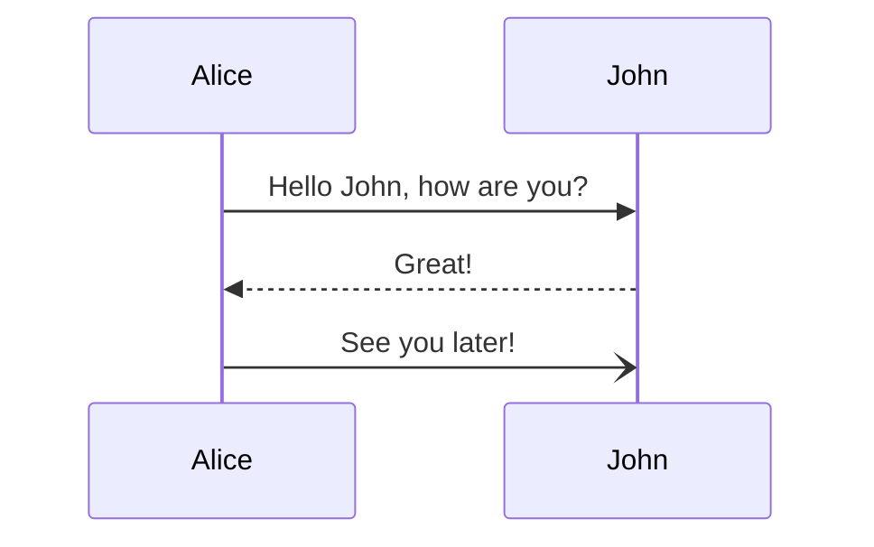
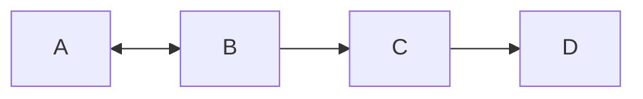
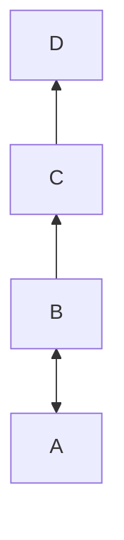

# シーケンス図

```mermaid
sequenceDiagram
    participant Alice
    participant John
    Alice->>John: Hello John, how are you?
    John-->>Alice: Great!
    Alice-)John: See you later!
```

# フローチャート

全体の流れを先に定義する
PlantUMLのが矢印毎に方向決められるので使いやすそう

LR（LEFTからRIGTH）

```mermaid
flowchart LR
  A<-->B
  B-->C
  C-->D
```
LR（BOTTOMからTOP）

```mermaid
flowchart BT
  A<-->B
  B-->C
  C-->D
```

